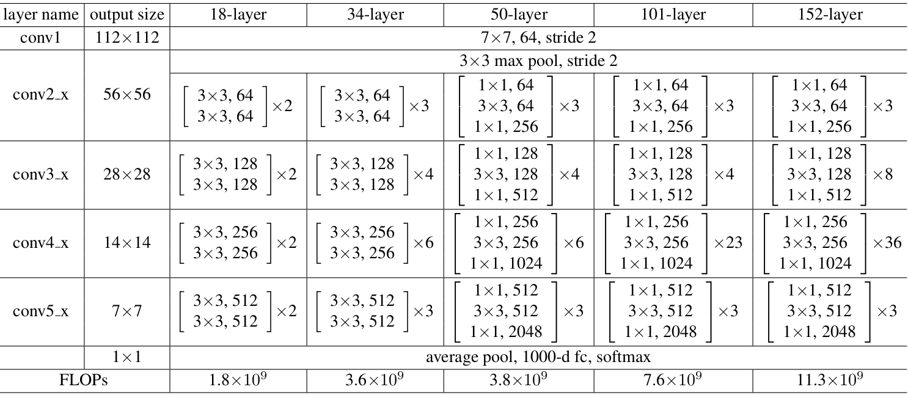

# zero-shot anomaly detection

Compare to the main code which is provided in  [this link](https://openaccess.thecvf.com/content/WACV2023/html/Aota_Zero-Shot_Versus_Many-Shot_Unsupervised_Texture_Anomaly_Detection_WACV_2023_paper.html), I have changed and tested different parts of the algorithm such as the training model, distance calculator, etc. These are all noted as different versions of the code below, also the performance of each version is reported.

# changing model
The main code uses the wide_resnet50_2 model for extracting needed features of each input texture image, It was mentioned in the provider's paper that they only use the model up to the 2nd layer as can be seen in the code.

The feature extraction from the model's 2nd layer was done by the hook method which gathers the output of the selected layer when there is a forward function happening in that layer, so I changed the model to do the same but prevent the other layers which comes after the 2nd layer from forwarding to reduce computation time.

# changing calculation score
I have changed the calculation score function which calculates the distance between k-nearest neighbors of an input image and returns the output as a heatmap.

# changing model sublayers
I have changed the model sublayers of each model layer's bottleneck (up-to 2nd layer) input and output size so it looks like the 50-layer model in the image below

# chaning dataset loader
I have changed the dataset loader to load input images in default resolution and not changing them; the point that has to be considered is that the model we are using (even if not the exact wide_resnet50_2 but the trained weights) has been trained on 320*320 images (from ImageNet) so for inputs with different resolution inaccuracy can be caused.  

# Result

|version  |Mother version |Method                       | avg. Runtime per image | avg. AUROC  | avg. Pixel AUROC |
|---------|---------------|-----------------------------|------------------------|-------------|------------------|
#01|-|default|1.969 s|99.5%|97.4%
#02|#01|feature extraction only up to 2nd layer|1.755 s|99.5%|97.4%
#03|#01|modified calc_score function|0.107 s|99.2%|97.1%
#04|#02|modified calc_score function|0.107 s|99.2%|97.1%
#05|#04|modified cnn model for feature extraction|0.074 s|99.2%|97.1%
#06|#04|input image size of 1024*1024 pixel|0.310 s|92.3%|-

